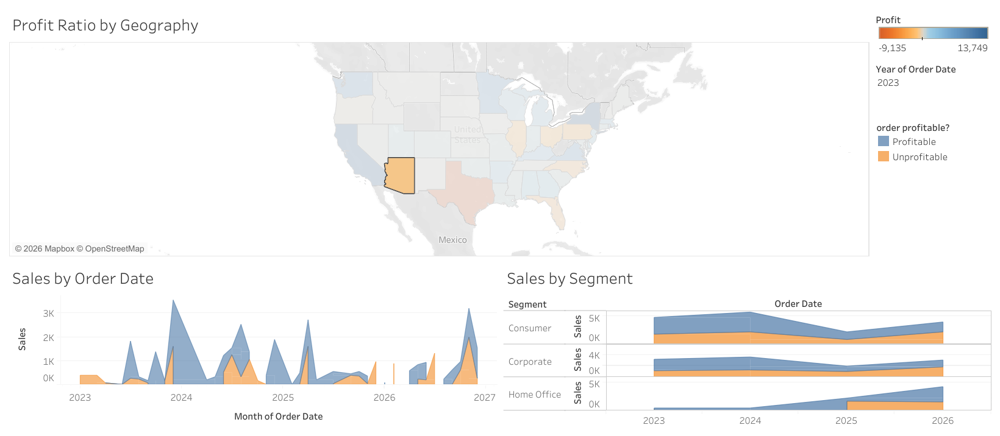

# Assignment 2 — Visualization Tools

## Overview
This assignment explores different visualization tools and their capabilities for analyzing data.

The tools used in this assignment are:
- Tableau Public
- RAWGraphs

## Dataset
I used the **[dataset name]** dataset from Tableau Sample Data.

Short description:
- Number of rows: ...
- Main attributes: ...
- Purpose: ...

---

## Tableau Visualizations

### Visualization 1 — Scatter Plot
Short explanation of what the chart shows.

**Observation:**  
Brief insight from the chart.

### Visualization 2 — Bar Chart / Map / Box Plot
Short explanation.

**Observation:**  
Brief insight.

---

## RAWGraphs Visualizations

### Visualization 3 — Parallel Coordinates Plot
Short explanation.

**Observation:**  
Brief insight.

---

## Reflection
- Tableau was easier for interactive analysis and filtering.
- RAWGraphs provided useful advanced chart types.
- Different visualizations revealed different patterns in the dataset.