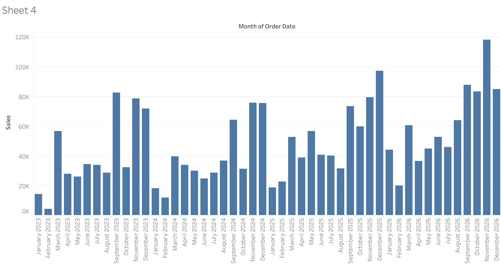
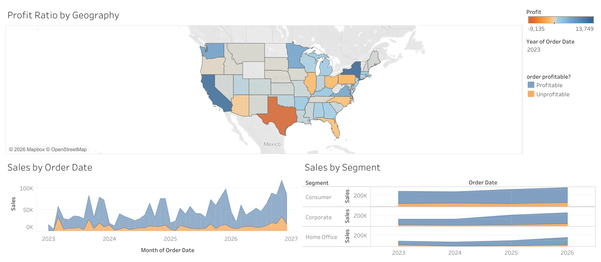
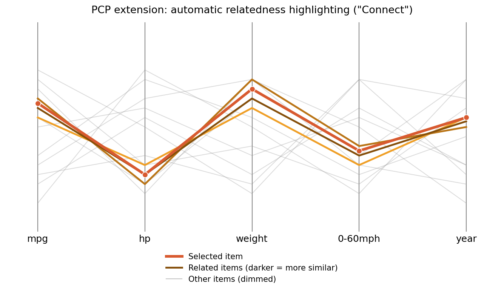

# Assignment 2 — Visualization Tools

## Overview
This assignment explores different visualization tools and their capabilities for analyzing data.

The tools used in this assignment are:
- Tableau Public
- RAWGraphs

## Dataset
I used the **Sample-Superstore** dataset from Tableau Sample Data.

Short description:  
- Number of rows: ~10,000  
- Main attributes: Order Date, Sales, Profit, Quantity, Category, Segment, State  
- Purpose: Analyze sales performance, profitability, and customer behavior across regions and product categories

---

## I. Visualization Tools

### Visualization 1 — Bar Chart

**Observation:**  
Sales fluctuate significantly over time, with several peaks and drops across the months. An overall increasing trend can be observed, especially toward late 2025 and 2026, where sales reach their highest values.

### Visualization 2 — Dashboard

This visualization shows profit by region, sales trends over time, and sales differences between customer segments.

This dashboard shows the same information as the previous one, but only for the selected state, making the analysis more focused.

**Observation:**  
*First dashboard:* Profitability varies across states, with some regions generating losses while others remain profitable. Sales generally increase over time, although there are noticeable fluctuations. Among customer segments, the Consumer segment contributes the highest sales, while Home Office contributes the least.

*Second dashboard:* After filtering to a single state, sales values become smaller and more irregular over time, showing stronger fluctuations. The selected state experiences both profitable and unprofitable periods, indicating less stable performance. The Consumer segment still contributes most of the sales.

## Reflection
- Tableau was easier for interactive analysis and filtering.
- RAWGraphs provided useful advanced chart types.
- Different visualizations revealed different patterns in the dataset.

---

## III. Interactions and Tasks

### How does PCP support Yi's categories of interaction?

- **Select** (mark something as interesting): Well supported. Clicking or hovering a single polyline highlights it, and dragging a small range on an axis (axis brushing) marks every record whose value falls inside that range.
- **Explore** (show me something else): Supported, though more limited than in a pan/zoom view. Sliding a brushed range along an axis, or scrolling through additional axes when there are too many dimensions to fit on screen, moves the analyst to a different subset of the data.
- **Reconfigure** (show me a different arrangement): Very well supported — this is PCP's signature interaction. Dragging an axis to a new horizontal position changes which dimensions sit next to each other, which directly changes which correlations are visually salient, since only adjacent axes reveal correlation patterns clearly.
- **Encode** (show me a different representation): Only partially supported. Axes can usually be rescaled (linear to log) or lines recolored/varied in opacity by an extra attribute, but swapping the whole view to a different chart type is not something the PCP itself does — that is the surrounding system switching visualizations.
- **Abstract/Elaborate** (show me more or less detail): Weakly supported by default. A plain PCP draws every record as one line, so large datasets immediately produce overplotting ("spaghetti"), with no built-in way to back off into an aggregated view; the only elaboration usually on offer is a tooltip showing one record's exact values on hover.
- **Filter** (show me something conditionally): Very well supported, arguably the second signature PCP interaction. Brushing one or more axes hides or fades every polyline that does not pass through the selected ranges, and multiple brushes combine as an AND filter.
- **Connect** (show me related items): Weakly supported. A standalone PCP has no built-in notion of "related items" beyond the lines already selected or filtered — it cannot indicate which other records resemble the one picked, unless it is wired up to a second, linked view.

### Extending PCP to better support "Connect"

The category that is least supported by PCP is **Connect**. Relatedness between records is currently something the analyst has to spot by eye, by noticing which lines run close together across several axes; the plot itself never computes or surfaces that relationship.

**Proposed extension — similarity-based auto-highlighting:** when a user selects a line, the system computes a similarity score between that record and every other record (e.g. normalized Euclidean distance across the plotted dimensions), then re-renders the plot in three tiers: the selected line stays bold and strongly colored, the top-*k* most similar lines are highlighted in a graded color scale where a darker shade means a closer match, and all remaining lines fade into a dimmed background. This brings "connect" inside the PCP itself rather than requiring a second, linked visualization.

