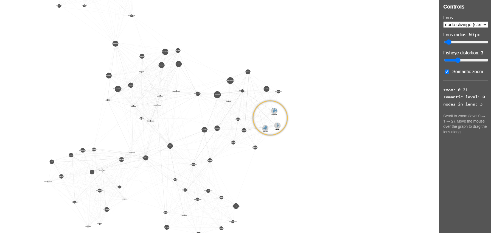
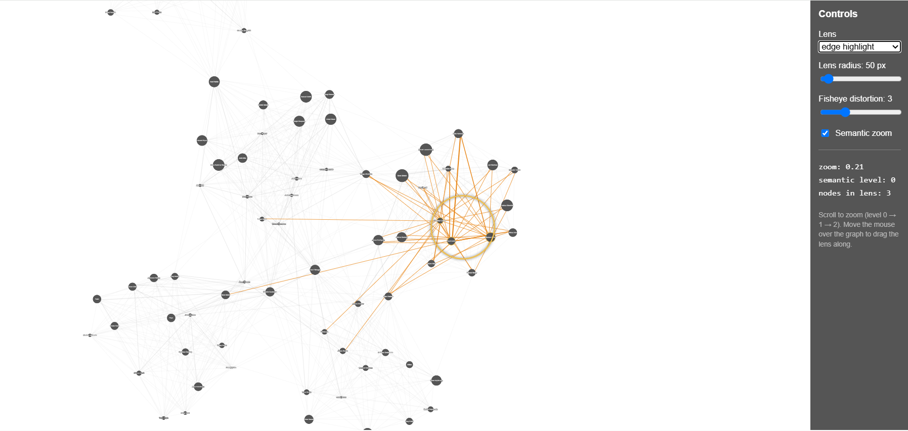
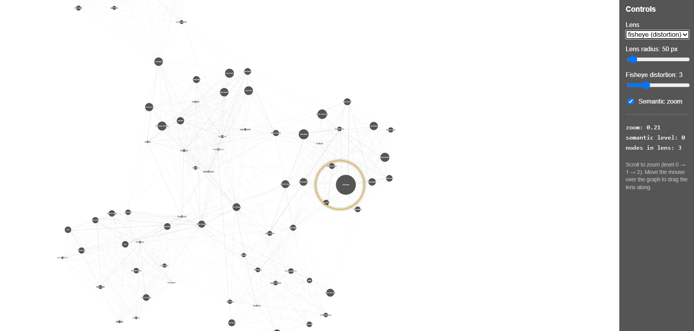

# InfoVis Assignment 4 — Semantic Zoom and Magic Lenses

Based on the files and code from https://js.cytoscape.org/demos/colajs-graph/

Network of 95 soccer players (nodes, up to 40 attributes each) and ~1050 co-club
relations (edges, weighted by how often two players shared a club).

## Running it

Pre-requisite: Node.js.

```
npm install serve --global
serve -p 8000
```

Then open http://localhost:8000.

## What was implemented

### 1. Semantic and constant density zoom

The current zoom factor comes from `cy.zoom()`. The three levels are defined
relative to the zoom factor that fits the whole graph into the viewport
(`state.baseZoom`, measured once the cola layout has settled), so the levels
behave the same regardless of window size:

| level | when | what is drawn |
| --- | --- | --- |
| 0 | zoom < 2× fit | only players with **at least 10 attributes**, all in the same style |
| 1 | 2×–5× fit | all players; those with **fewer than 10 attributes** become orange rounded squares |
| 2 | > 5× fit | a **D3 star plot** with all attributes is painted on every node |

Star plots are drawn with the provided `RadarChart` function into a hidden
`#star-factory` div, serialised to an SVG data URI and used as the cytoscape
node `background-image`. Each URI is cached on its node, so a plot is built at
most once per player.

Only nodes inside the viewport get a star plot (`nodesInView`), which keeps
level 2 cheap — at that zoom only a handful of nodes are on screen.

The axes are normalised per attribute (value ÷ maximum of that attribute over
all players), because the attributes live on very different scales (`touches` in
the hundreds vs. `punches` in single digits). All 33 attributes that occur
anywhere in the data set are used as axes, in the same order on every node, so
the shapes can be compared between players; an attribute a player does not have
is drawn as 0 (e.g. the keeper attributes of an outfield player).

### 2. Magic lenses

The lens is the SVG circle from the template. It follows the cursor (`cy.on("mousemove")`,
throttled), and a node counts as "inside" when `isInCircle` holds for its
`renderedPosition()` — i.e. the lens works in screen space and keeps its size on
screen no matter how far the view is zoomed in.

Three lens functionalities, selectable in the UI:

* **node change** — the nodes under the lens get the level‑2 star plot, even when
  the semantic zoom is at level 0 or 1.
* **edge highlight** — every edge incident to a node under the lens is drawn thick
  and orange (`edge.magic` in `style.js`).
* **fisheye (extra task)** — a distortion lens built on the bundled `d3-fisheye`.
  Node positions are pushed through the distortion in rendered coordinates and
  converted back to model coordinates; nodes are also magnified by the scale
  factor the fisheye returns. The undistorted position of every node is kept in
  its scratchpad, so leaving the lens (or switching it off) puts everything back.

### 3. UI controls

* `select` — switch between off / node change / edge highlight / fisheye
* slider — lens radius (30–400 px)
* slider — fisheye distortion strength
* checkbox — enable/disable the semantic zoom (when off, the plain geometric zoom
  of cytoscape is all that remains and every node keeps the same style)
* a small readout of the current zoom factor, semantic level and number of nodes
  under the lens

## Visualization





## Reflection: why is the edge highlight not a local edge lens?

The edge highlight selects edges by a local criterion — "is one of my endpoints
under the lens?" — but that is not what makes a lens a lens.

**1. The effect is global, not local.** The highlight changes the appearance of a
whole edge, over its entire length. An edge that starts at a node under the lens
and ends at the far side of the screen is drawn orange all the way, so the lens
alters the image in places that are nowhere near the lens region. A local edge
lens only changes what is rendered *inside* the lens area; everything outside it
stays exactly as it was. The lens is a bounded region of altered representation,
whereas the highlight is a global re-styling that happens to be triggered by a
local selection.

**2. It adds emphasis instead of removing clutter.** In a dense graph the real
problem inside the lens region is occlusion: hundreds of edges merely *pass
through* the region without being connected to any node in it. The highlight
leaves all of them in place — it only makes some edges louder, so the focus area
actually becomes busier than before. The local edge lens works the other way
round: within the lens it suppresses exactly those pass-through edges and keeps
only the edges truly incident to the nodes in focus, so the local neighbourhood
becomes readable. One is an emphasis technique, the other is a local filter that
resolves occlusion.

(A third, smaller point: the highlight is purely a style change and never touches
geometry, while lenses in general may also displace or re-route what they show —
as the fisheye lens in the extra task demonstrates.)

## Files

* `index.html` — canvas, lens circle, the hidden star-plot factory and the controls
* `script.js` — data loading, semantic zoom, the three lenses, control wiring
* `style.js` — cytoscape stylesheet, including the `hidden` / `sparse` / `star` /
  `magic` classes used by the zoom and the lenses
* `style.css` — layout of the page and of the control panel

Note: the template's edge width mapping (`mapData(weight, 0, 1, 1, 8)`) did not
match the data — the weights run from 1 to 3, and `mapData` does not clamp, so
every edge was drawn far too thick. It is now `mapData(weight, 1, 3, 1, 5)`.
